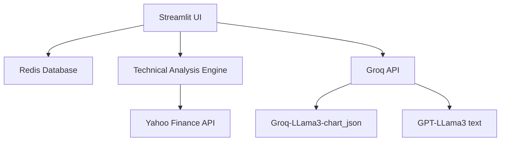
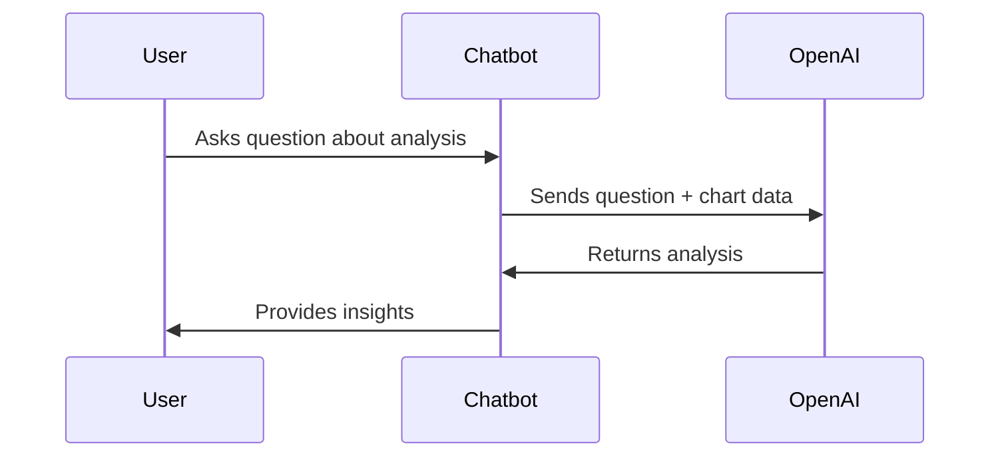

# Stock Analyst Application - Technical Documentation

## Overview
The Stock Analyst Application is a comprehensive platform that empowers financial analysts and investors with AI-powered stock analysis, technical charting, and portfolio recommendations. Built with Python and Streamlit, it integrates real-time market data, Redis database storage, and OpenAI's GPT models for intelligent insights.


## Key Features

### 1. Role-Based Access Control
- **Analysts**: Perform technical analysis, generate reports, manage investor portfolios
- **Investors**: View assigned reports, track portfolio recommendations
- **Secure Authentication**: Password-protected with bcrypt hashing

### 2. Technical Analysis Engine
- Real-time stock data from Yahoo Finance
- 50-day and 200-day Simple Moving Averages (SMA)
- Moving Average Convergence Divergence (MACD)
- Relative Strength Index (RSI)
- Bollinger Bands volatility analysis
- Automated trading signals and portfolio allocation recommendations

### 3. AI-Powered Insights
- GPT-4 Turbo with Vision for chart analysis
- Natural language explanations of technical patterns
- Context-aware responses based on current analysis
- Educational insights about market indicators

### 4. Reporting System
- Historical report storage with Redis
- Interactive Plotly charts
- Portfolio allocation recommendations
- Date-stamped analysis records

### 5. Visualization
- Interactive price charts with technical indicators
- MACD and RSI subplots
- Responsive design for all devices
- Exportable chart images

## Technical Architecture



### Component Breakdown:
1. **Frontend**: Streamlit web interface
2. **Authentication**: Custom RBAC with Redis storage
3. **Data Layer**: Redis for user data and reports
4. **Analysis Engine**: TA-Lib indicators with yfinance data
5. **AI Module**: OpenAI integration for natural language insights

## How It Works

### Analysis Workflow
1. Analyst selects investor and stock ticker
2. System fetches historical price data
3. Technical indicators are calculated
4. Trading signals are generated
5. AI analyzes charts and provides insights
6. Report is saved to database
7. Investor accesses report through portal

### AI Chatbot Process


## Setup Instructions

### Prerequisites
- Python 3.8+
- Redis server
- OpenAI API key

### Installation
```bash
# Clone repository
git clone https://github.com/yourusername/stock-analyst-app.git
cd stock-analyst-app

# Create virtual environment
python -m venv venv
source venv/bin/activate  # Linux/Mac
venv\Scripts\activate    # Windows

# Install dependencies
pip install -r requirements.txt

# Set up environment variables
cp secrets.example .env
# Edit .env with your actual credentials
```

### Database Initialization
```bash
# Initialize database
set INIT_DB=true
streamlit run app.py
```

### Running the Application
```bash
# After initial setup
set INIT_DB=
streamlit run app.py
```

## Usage Guide

### Analyst Features
1. **Select Investor**: Choose from assigned investors
2. **Analyze Stock**: 
   - Enter stock ticker (e.g., AAPL)
   - Select analysis period (1mo-2y)
   - Click "Analyze Stock"
3. **Review Results**:
   - Price chart with SMA and Bollinger Bands
   - MACD and RSI subplots
   - Trading recommendation
4. **Save Report**: Automatically stored in database
5. **Historical Reports**: Access previous analyses

### Investor Features
1. **View Reports**: Access all assigned analyses
2. **Chat with AI**: Ask questions about reports
3. **Track Recommendations**: See portfolio allocation advice

### AI Chatbot Examples
- "Explain the MACD crossover in this chart"
- "Why is this stock considered oversold?"
- "What do the Bollinger Bands indicate?"
- "How reliable is this buy signal?"

## Technology Stack

| Component          | Technology               |
|--------------------|--------------------------|
| Frontend           | Streamlit                |
| Backend            | Python 3.10             |
| Database           | Redis                    |
| Data APIs          | Yahoo Finance (yfinance)|
| AI                 | OpenAI GPT-4/GPT-3.5    |
| Technical Analysis | TA-Lib                   |
| Visualization      | Plotly                   |
| Authentication     | bcrypt                   |
| Deployment         | Docker, Streamlit Cloud  |

## Future Enhancements
1. **Sentiment Analysis**: News and social media monitoring
2. **Portfolio Simulation**: Virtual trading environment
3. **Alert System**: Price and indicator notifications
4. **Multi-Asset Support**: Cryptocurrencies, forex, commodities
5. **PDF Export**: Shareable report generation
6. **Performance Backtesting**: Historical strategy testing

## Troubleshooting

### Common Issues
1. **Redis Connection Failed**:
   - Ensure Redis server is running
   - Verify host/port in `.env`

2. **Missing Stock Data**:
   - Check ticker symbol validity
   - Try different analysis period

3. **Chart Display Issues**:
   - Update Plotly and Streamlit
   - Clear browser cache

4. **AI Analysis Failures**:
   - Verify OpenAI API key
   - Check usage limits

### Debugging Tips
```
# Check Redis connection
redis-cli ping

# View logs
streamlit run app.py --logger.level=debug
```
## Demo Access

Test the application with these pre-configured accounts:

### Analyst Account
```
Username: analyst1
Password: analystpass
```

### Investor Accounts
```
Username: investor1
Password: investorpass

Username: investor2
Password: investorpass
```

